## Dynatrace + Red Hat Ansible Automation Platform : Auto-Remediation

## Requirements:
* Dynatrace SaaS or Managed environment
* Dynatrace API Token with the following permissions: `Read configuration`, `Write configuration`, `Access problem and event feed, metrics, and topology`
* Ansible Automation Platform with Controller instance
* GitHub repository forked from this repository
* GitHub Personal Access Token

## Deployment and Setup:
### Automated Deployment Using Ansible Controller
Most of the setup can be automated using Ansible Controller with the included `deploy-dynatrace-autoremediation.yml` playbook.

#### Organization
The integration should be deployed within an Organization.  Choose one, or create a new one.  Note the Organization id in the address bar (`/#/organizations/{id}/details`).
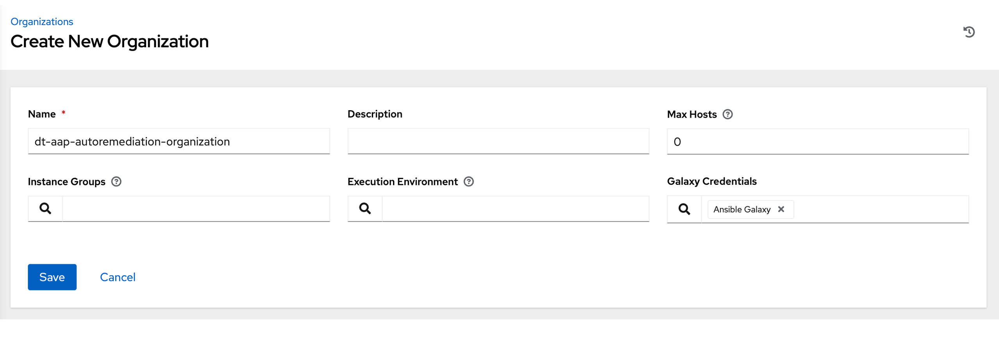

#### Project
Create a new Project for the integration within the Organization.  The Project connects to your (forked) Git repository.  You’ll need Source Control Credential set up with your (GitHub) Personal Access Token for authentication.  After creation, note the Project id in the address bar (`#/projects/{id}/details`).
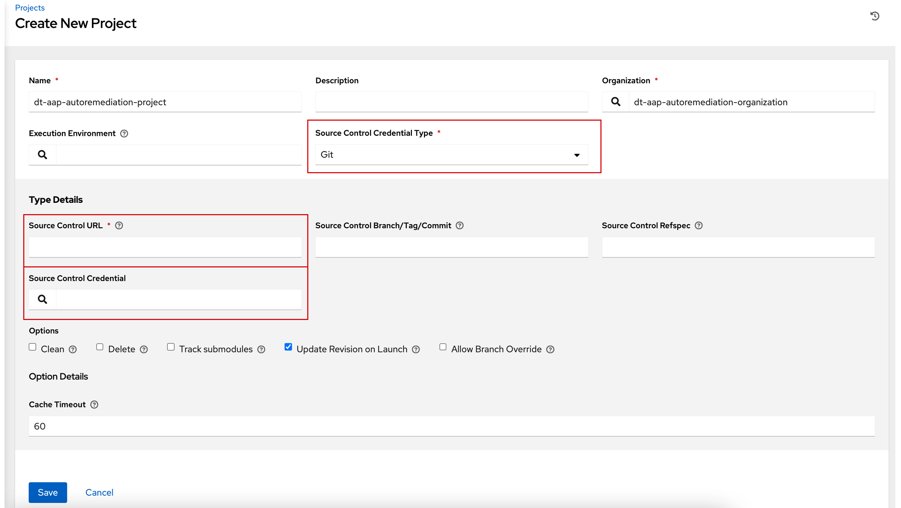

#### Inventory
The integration (and automated deployment) should be executed by your Ansible Controller host (only run on 1 host).  Create an Inventory within the Organization.  Add the Ansible Controller host to the inventory.
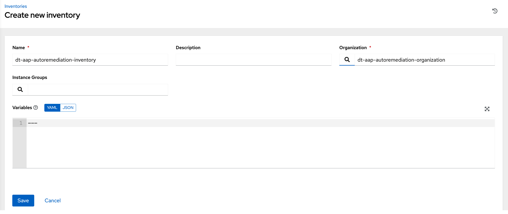
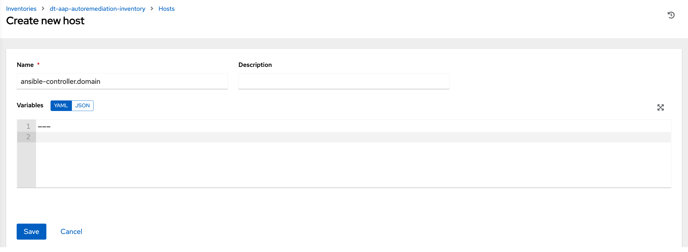

In order to execute on your Ansible Controller host, you'll need a Machine Credential (SSH user+key).  Create one if it doesn't already exist.
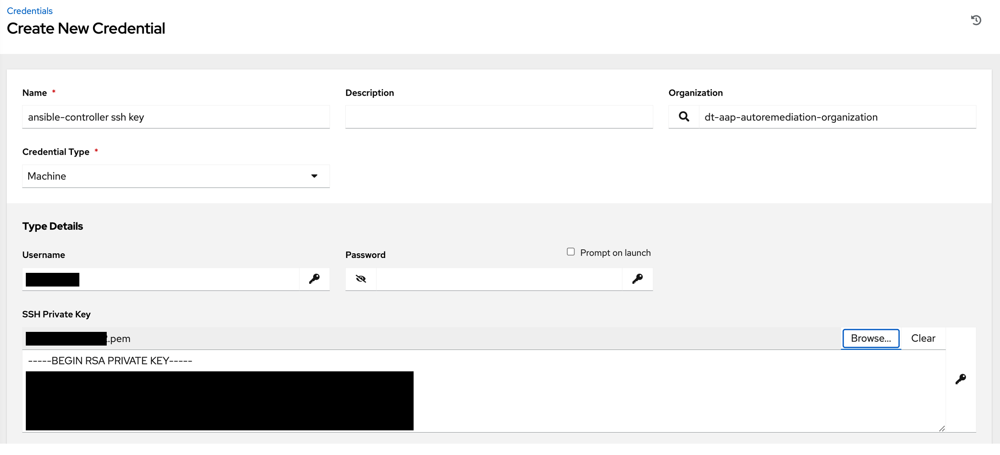

#### Job Template
Create a new Job Template within the Organization.  Select the Inventory, Project, and Credential from the previous steps.  Choose the `deploy-dynatrace-autoremediation.yml` playbook.
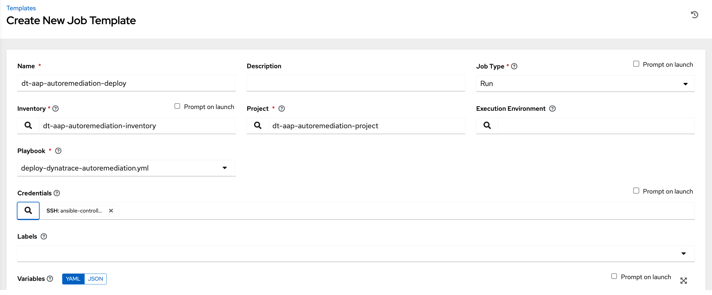

Add the required Variables to the Job Template.  Change the values accordingly to match the specifications of your environment.

**hosts_group**: "" # host name or inventory group for the ansible controller\
**ansible_controller_api_host**: "" # host name or ip address for the ansible controller providing the REST API\
**ansible_controller_api_user**: "" # ansible controller user name with permissions to create ansible objects via REST API\
**ansible_controller_api_password**: "" # ansible controller user password\
**ansible_controller_organization**: 1 # ansible controller organization integer id this job template is part of\
**ansible_controller_project**: 1 # ansible controller project integer id this job template is part of\
**ansible_controller_playbook**: "dt-ansible-autoremediation-playbook.yml" # ansible playbook yml to deploy\
**credentials_ansible_username**: "dt-aap-autoremediation-user" # ansible controller user created to execute the job template\
**credentials_ansible_password**: "changeme" # ansible controller user password, should be changed manually after testing\
**credentials_dynatrace_url**: "https://abc123.live.dynatrace.com/api" # dynatrace base api url\
**credentials_dynatrace_token**: "dt0c01.XYZ" # dynatrace api token with sufficient permissions\

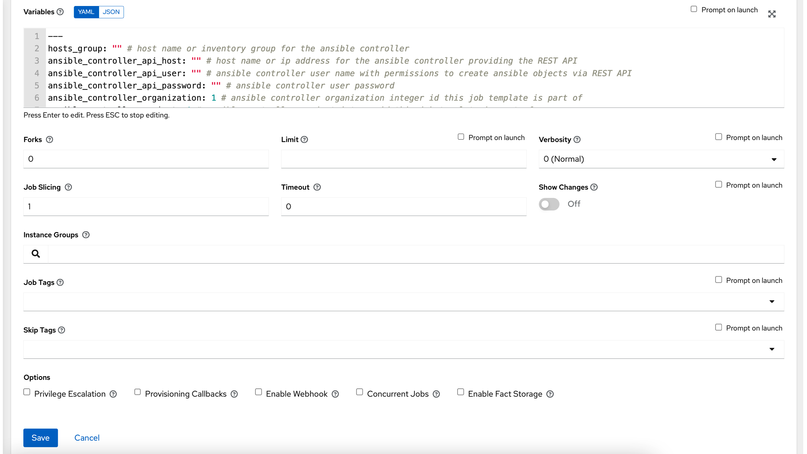

#### Launch Job
Launch the Job Template and validate that the Job completes successfully.
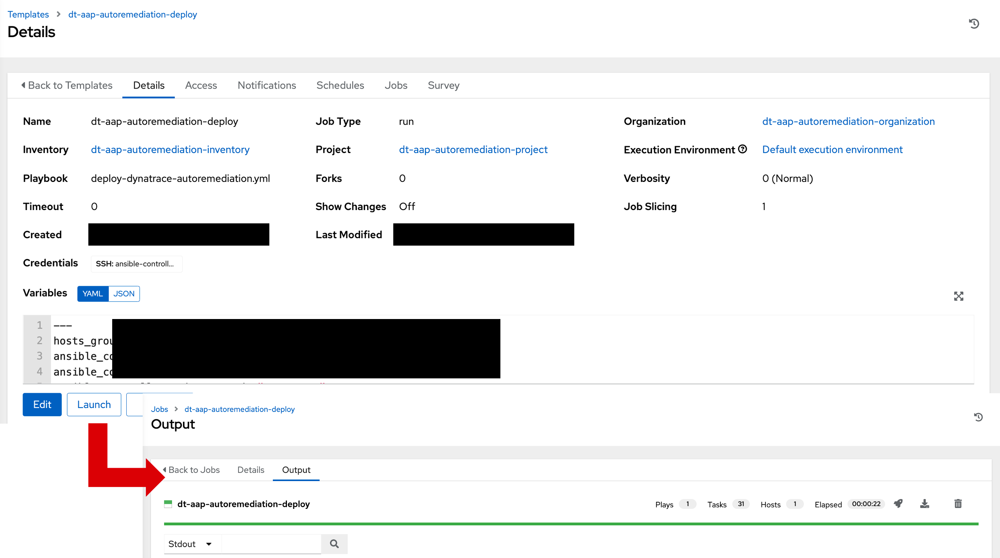

Two Credential Types are created.
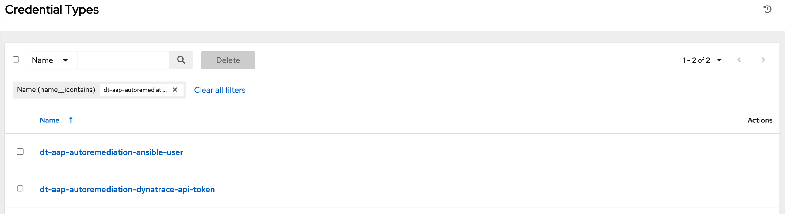

Two Credentials are created.
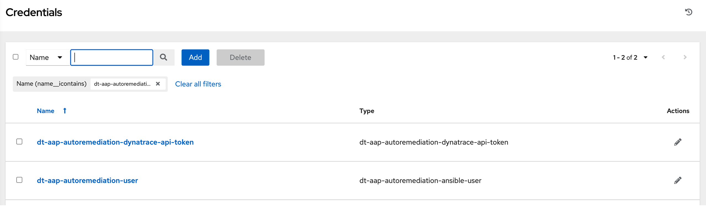

One User is created.
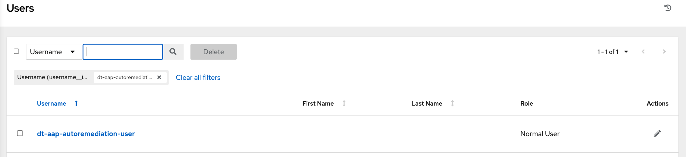

One Job Template is created.
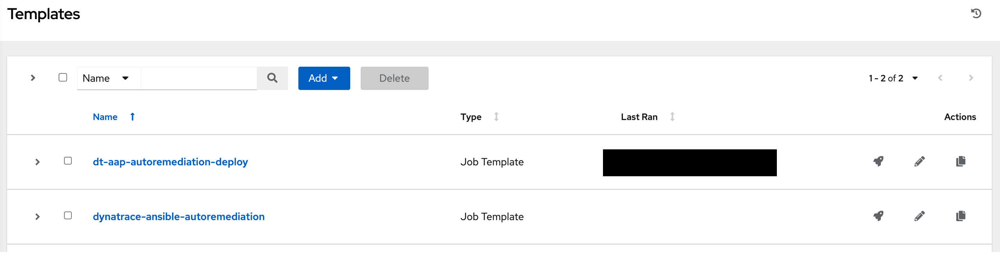

One Dynatrace Alerting Profile is created.

One Dynatrace Problem Notification is created.
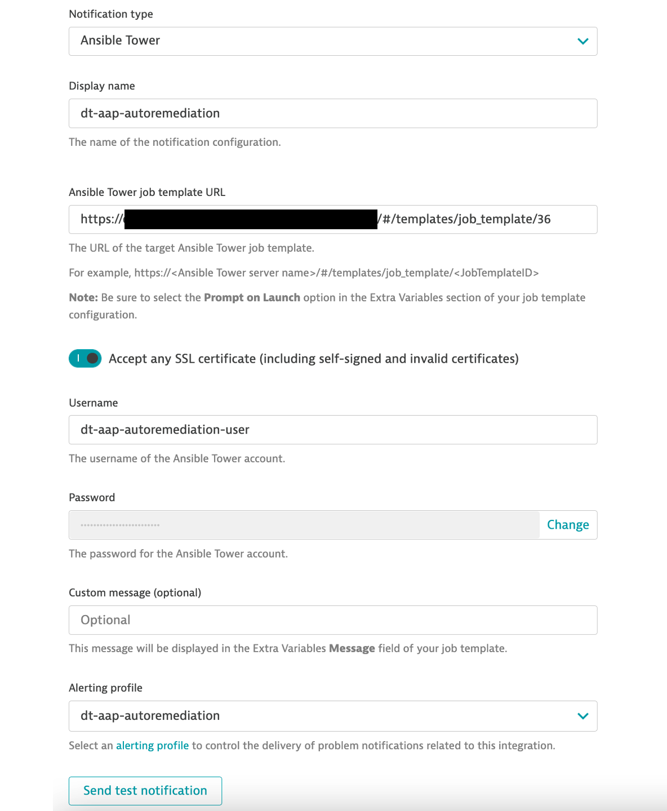

#### Manual Steps Required
A few steps are not automated at this time, perform these steps manually.

Edit the `dynatrace-ansible-autoremediation` Job Template.  Add the Machine Credential and two new Credentials.  Change the Variable values accordingly to match the specifications of your environment.
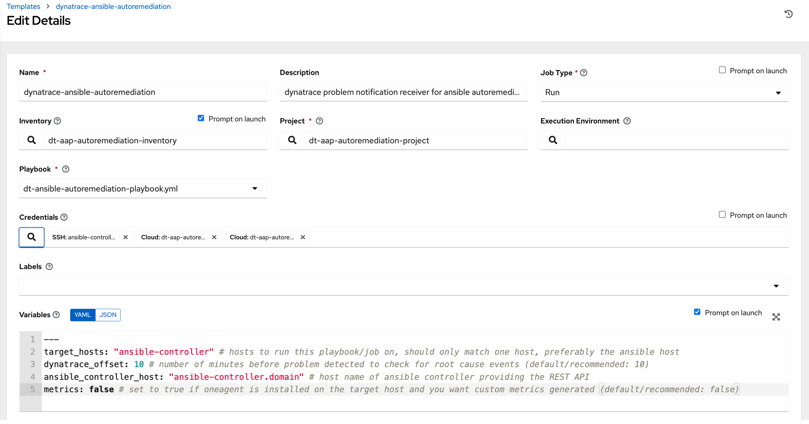

From the Access tab, click the `Add` button to add a user role.  Select the User that was created and add the `Execute` Role.
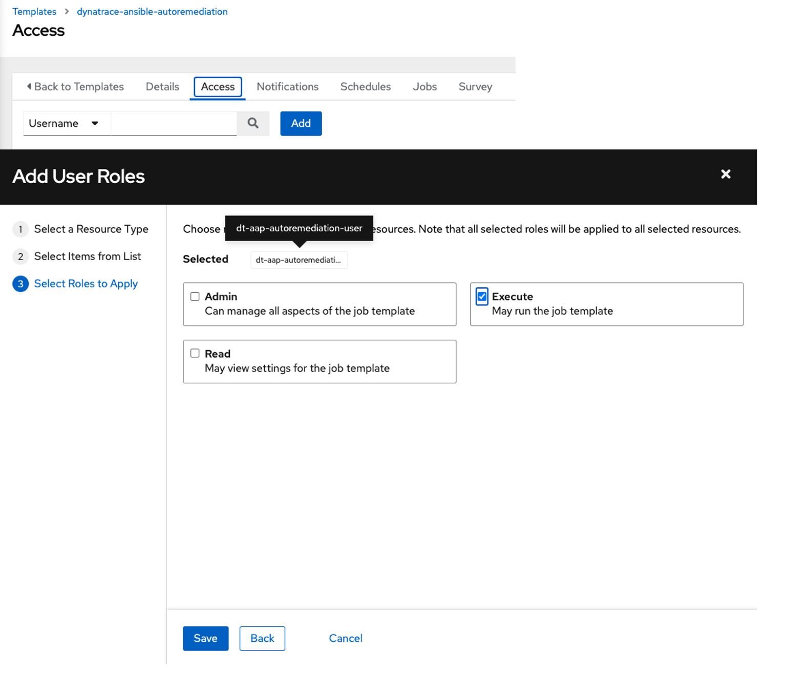

In Dynatrace, locate the Problem Notification.  Click the `Send test notification` button to validate the connection between Dynatrace and Ansible Controller.
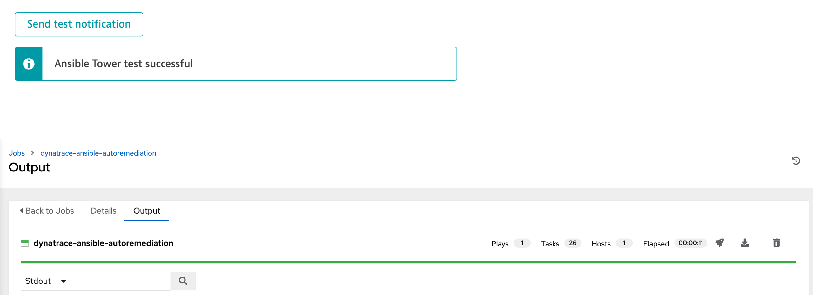
